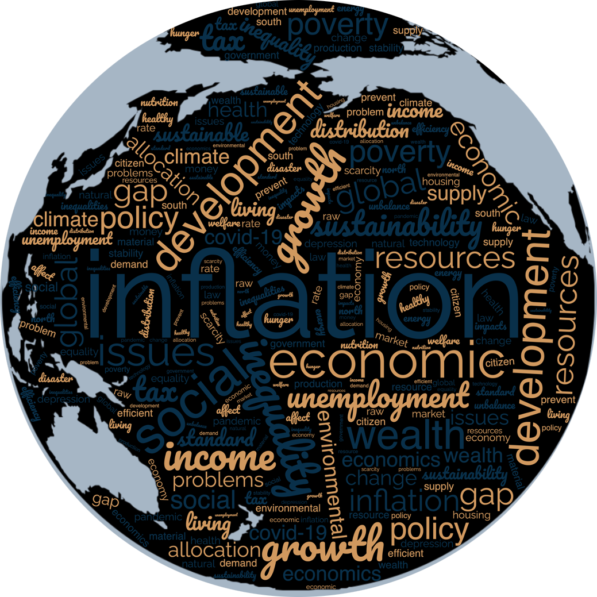
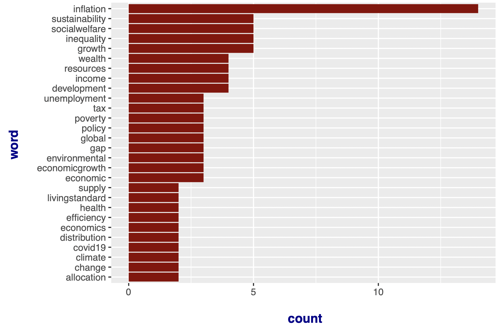

# Text Analysis: What Topics Do Economists Care About? 

<h6>Figure 1 - Word Clouds (This plot was created on website word clouds (https://www.wordclouds.com) using the data I collected)</h6>

## Chapter 1. The Words in a Cloud

"What topics do economists care about?" In an intro econometrics class, the professor I was TAing for asked this question to the young undergraduate students. Behind the screen, there was silence for a moment - they were in deep thought. These eighty aspiring future economists could potentially rock the global economy. As an economics PhD student myself, I have to constantly think about this question while constructing my academic paper. 

Thanks to Zoom, it was possible for me to collect these texts and see what the students think about "what economics is really about." Although these texts were initially collected for counting class participation, I took the liberty and did some further analysis. Note that all the text data available here is masked so that no particular student can be identified. 

It was not an easy question, but these students answered well. From Figure 1, we can see that their most extensive interest  was "inflation." They even foresaw this problem, given the world state back then was not as mad. 

## Chapter 2. Text Data 

(For data, see my [GitHub page](https://github.com/NicoleGolden/TextAnalysis_project/).)

### Data collection 
The data used in this analysis is compiled with multiple zoom chat records in .txt format. The time period is the first two weeks of my econometrics class. All identity-related information is scraped off so that no student can be identified. 

### Data cleaning 
Texts irrelevant to economics (e.g., lol, hi) were removed. A deeper layer of cleaning includes grouping the words when necessary. For example, "covid-19" was identified as separate words "covid" and "19" by the `stringr` package in R. I rearranged the word as "covid19." Another example is that "economic growth" was mentioned repeatedly, so I grouped the two words as "EconomicGrowth."

I generated four final datasets in the end: 
1\. `chat_counts.csv`: This file is created to count words related to the class each student texted in the Zoom chatbox. These words can be economics-related or can be answering class questions. The file consists of 2 variables: (1) an arbitrarily assigned student `id` that goes from 1 to 80. (2) `total_count`, which is the total word count for each student. It is used to get the total word count summary and histogram (so that we get a general idea of class participation).
2\. `wordcloud.txt`: I compiled all text answers for the question "What topics do economists care about" in this file. Then I copied/pasted all texts to [word clouds](https://www.wordclouds.com) and created the word cloud as displayed in Figure 1. 
3\. The first **text** appeared in the `text_analysis.Rmd` file. These are all class-related texts. Using this data, I can find the top 10 most used words in class and plot the top 30 most frequently used words. 
4\. The second **text** appeared in the `text_analysis.Rmd` file. This is the most interesting part. These texts answer the question, "What topics do economists care about?" I got the top 10 words to answer this question and plot the top 30 most frequently used words. 

## Chapter 3. So, what topics do economists care about? 

(The rest of the words will just circle around Figure 3.)

<h6>Figure 3 - What Topics Do Economists Care About?</h6>

So, what topics do economists care about? At least, what the students think "what the economists care about?" This question can be rephrased as "What problems in the world are happening that need economists' attention?" The students have a say. Just look at Figure 3 - they largely voted for "inflation." That was back in October 2021 when the Covid was still raging in the US. The word "covid19" ranked just 25 out of 28 based on the figure. So, either people are really wary of the covid, or the inflation problem at the time was really worrisome. In their economic essays (for my other economics classes), some students wrote that supply chain became an issue. It became too expensive to get a hold of an iPad, or games were out of stock quickly. On the other hand, the demand also grew very strong. 

Other high-ranked topics are also important to us. For example, economic sustainability can mean improving our environment (in simple words, a terrible environment is not sustainable to our economy). Social welfare can refer to income inequality, resource distribution, living standard, etc. Covid-19 is also something we need to worry about. When asked this question, people were more hopeful since the delta variant cases were going down! We did not anticipate the bad news that the omicron variant came. It was even more transmissive and swept across the US more widely and violently. 

The covid-19, the shortage of staff and trucks, and the Ukrainian war are all bringing new waves to inflation. Economists are certainly worried. This is what economists care about. And more as the time comes. 

 
